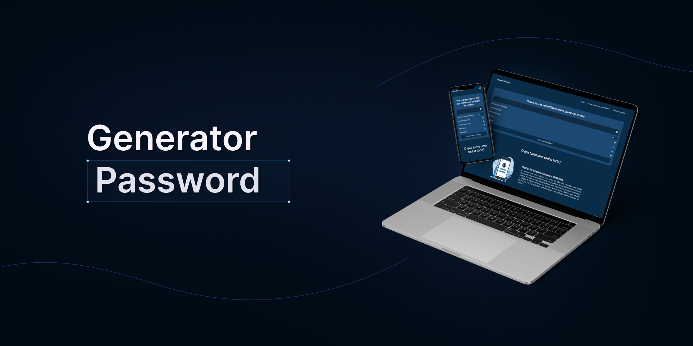

<h1 align="center">🔒 Generator Password</h1>

  <strong>Aplicação realizada com finalidade de gerar uma senha segura e aleatória online e gratuita</strong>

  

### Site 💻

- [Generator Password](https://generatorpassword-free.netlify.app/)

## Linguagens: 🚀
- HTML
- CSS
- JavaScript

## Referências: ⌨️

- [Passwords Generator ](https://passwordsgenerator.net/)
- [Last Pass ](https://www.lastpass.com/pt/features/password-generator)
